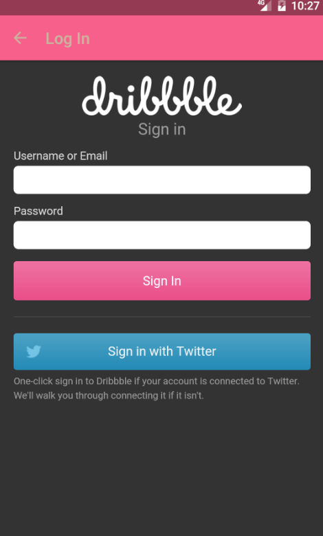
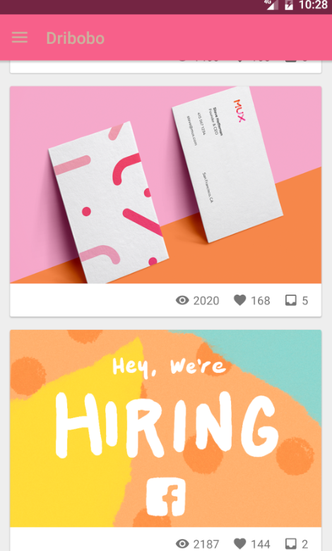
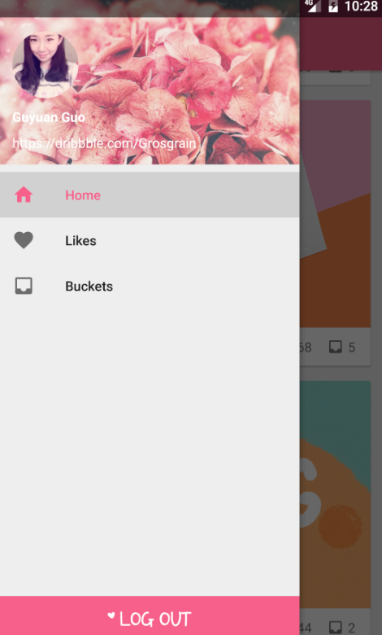
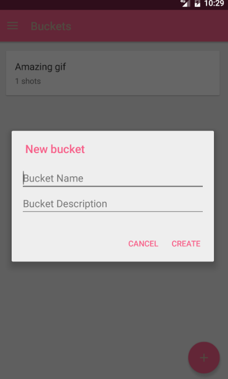
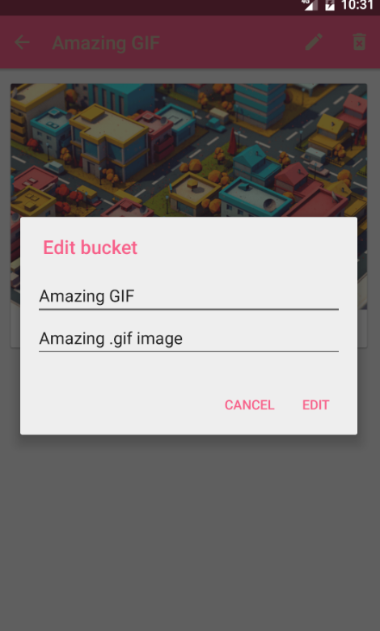

# Dribobo
1.Welcome Page

2.Login Page

Login with username and password that registered on Dribbble.com

3.Home Page

Display most up to date shot from Dribbble.com

4.Navigation Drawer

Utilize navigation drawer to direct to Home/Like/Bucket page

5.Create Bucket

Create user bucket

6.Edit and Delete Bucket

Enable to create and delete user bucket

